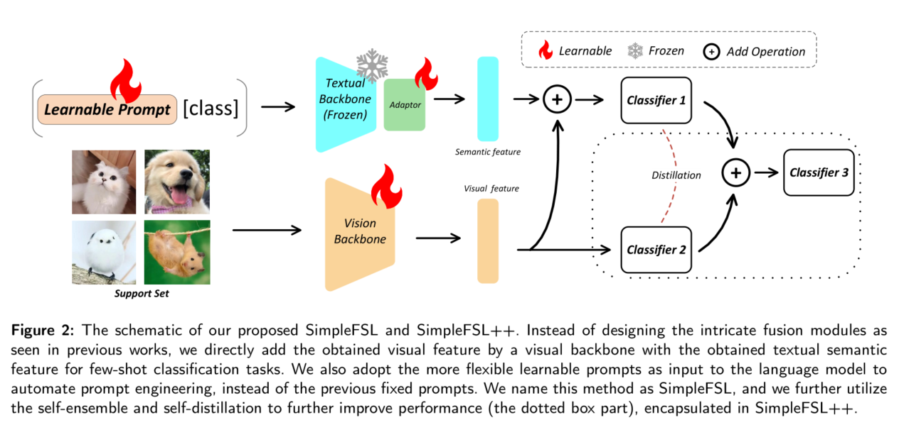

# Simple Baseline of Semantic-based Few-Shot Learning

This repo contains the reference source code for the paper [Less is More: A Closer Look at Semantic-based Few-Shot Learning](https://arxiv.org/abs/2401.05010)




### Abstract
Few-shot Learning (FSL) aims to learn and distinguish new categories from a scant number of available samples, presenting a significant challenge in the realm of deep learning. Recent researchers have sought to leverage the additional semantic or linguistic information of scarce categories with a pre-trained language model to facilitate learning, thus partially alleviating the problem of insufficient supervision signals. Nonetheless, the full potential of the semantic information and pre-trained language model have been underestimated in the few-shot learning till now, resulting in limited performance enhancements. To address this,  we propose a straightforward and efficacious framework for few-shot learning tasks, specifically designed to exploit the semantic information and language model. Specifically, we explicitly harness the zero-shot capability of the pre-trained language model with learnable prompts. And we directly add the visual feature with the textual feature for inference without the intricate designed fusion modules as in prior  studies. Additionally, we apply the self-ensemble and distillation to further enhance performance. Extensive experiments conducted across four widely used few-shot datasets demonstrate that our simple framework achieves impressive results. Particularly noteworthy is its outstanding performance in the 1-shot learning task, surpassing the current state-of-the-art by an average of 3.3\% in classification accuracy. 


### Requirements
* Python >= 3.8
* PyTorch >= 1.7.1
* clip (https://github.com/openai/CLIP)


### Datasets
* miniImageNet: https://rec.ustc.edu.cn/share/1341cd00-ffa6-11ed-8581-c30591dc01d6
* tieredImageNet: https://rec.ustc.edu.cn/share/3df5e760-ffa6-11ed-accd-c197f7deb7f7
* CIFAR-FS: https://rec.ustc.edu.cn/share/58e3c480-ffa6-11ed-bdc6-31dddcd9f8de
* FC100: https://rec.ustc.edu.cn/share/72752780-ffa6-11ed-86c2-435b9749436f


Download the dataset you need and put the xxx.tar.gz in ./dataset
```
cd ./dataset
tar -xvzf xxx.tar.gz
```

### Scripts
#### Pre-train the feature extractor
* miniImageNet
```
python train_vit.py --gpu 0 --dataset miniImageNet --exp pre-train --rand_aug --repeat_aug
```
* tieredImageNet
```
python train_vit.py --gpu 0 --dataset tieredImageNet --exp pre-train --rand_aug --repeat_aug --epochs 300
```
* CIFAR-FS
```
python train_vit.py --gpu 0 --dataset CIFAR-FS --exp pre-train --rand_aug --repeat_aug
```
* FC100
```
python train_vit.py --gpu 0 --dataset FC100 --exp pre-train --rand_aug --repeat_aug
```

#### Train and evaluate SimpleFSL++
* miniImageNet
```
python train_vit_sp.py --gpu 0 --dataset miniImageNet --exp SimpleFSL --init checkpoint/miniImageNet/visformer-t/pre-train/checkpoint_epoch_800.pth --shot 1
```

* tieredImageNet
```
1-shot: python train_vit_sp.py --gpu 0 --dataset tieredImageNet --exp SimpleFSL  --rand_aug --train_episodes 600 --init checkpoint/tieredImageNet/visformer-t/pre-train/checkpoint_epoch_300.pth --shot 1
```

* CIFAR-FS
```
1-shot: python train_vit_sp.py --gpu 0 --dataset CIFAR-FS --exp SimpleFSL --init checkpoint/CIFAR-FS/visformer-t/pre-train/checkpoint_epoch_800.pth --shot 1
```
* FC100
```
python train_vit_sp.py --gpu 0 --dataset FC100 --exp SimpleFSL --init checkpoint/FC100/visformer-t/pre-train/checkpoint_epoch_800.pth --shot 1
```
If you want train and evaluate SimpleFSL, just set KD = 0.


## Citation
If you find our code useful, please consider citing our work:

Zhou C, Wang H, Yuan X, et al. Less is More: A Closer Look at Multi-Modal Few-Shot Learning[J]. arXiv preprint arXiv:2401.05010, 2024.
```
@article{zhou2024less,
  title={Less is More: A Closer Look at Multi-Modal Few-Shot Learning},
  author={Zhou, Chunpeng and Wang, Haishuai and Yuan, Xilu and Yu, Zhi and Bu, Jiajun},
  journal={arXiv preprint arXiv:2401.05010},
  year={2024}
}
```

## Acknowledgements
Our implementations build upon several existing publicly available code from the following repositories:

* https://github.com/WentaoChen0813/SemanticPrompt
* https://github.com/KaiyangZhou/CoOp